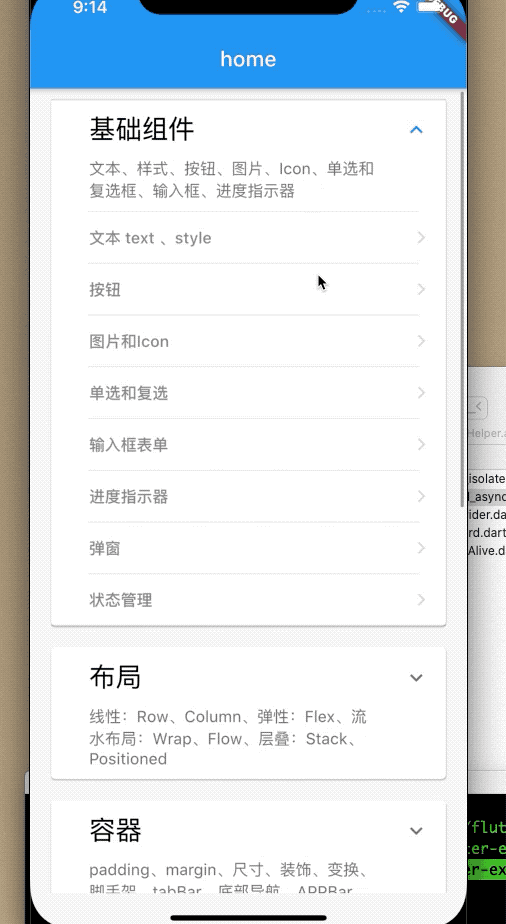

# flutter-example
根据 flutter-book的例子,所有连接均为代码示例。

##  Flutter 各种小部件使用例子

* [1. Flutter基础组件](#)
	* [1.1 文本 style](lib/baseWidget/baseText.dart)
	* [1.2 按钮](lib/baseWidget/baseButtons.dart)
	* [1.3 图片和Icon](lib/baseWidget/imgAndIcon.dart)
	* [1.4 输入框和表单](lib/baseWidget/baseTextField.dart)
	* [1.5 进度指示器](lib/baseWidget/baseIndicator.dart)
	* [1.6 弹窗](lib/baseWidget/dialog.dart)
	* [1.7 状态管理](lib/baseWidget/baseState.dart)
	* [1.8 单选和复选](lib/baseWidget/baseSwitch.dart)
* [2. 布局](#)
	* [2.1 绝对位置](lib/layout/base_stack.dart)
	* [2.2 相对位置](lib/layout/base_align.dart)
	* [2.3 弹性布局 Row  Column](lib/layout/base_row_and_column.dart)
	* [2.4 弹性布局flex](lib/layout/baseFlex.dart)
	* [2.5 流式布局 wrap flow](lib/layout/base_flow_and_wrap.dart)
* [3. 容器](#)
	* [3.1 padding](/lib/container/base_padding.dart) 
	* [3.2 container容器](/lib/container/base_container.dart)
	* [3.3 尺寸限制容器](/lib/container/base_constraints.dart)
	* [3.4 装饰类容器](/lib/container/base_decorateBox.dart)
	* [3.5 变换transform](/lib/container/base_transform.dart)
	* [3.6 裁剪容器](/lib/container/base_clip.dart)
	* [3.7 导航 脚手架 Tabbar](/lib/container/base_bars.dart)

* [4. 滚动组件](#)
	* [4.1 SingleScrollView](lib/scrollview/baseSingleChildScrollView.dart)
	* [4.2 listview](lib/scrollview/baseListView.dart)
	* [4.3 gridview](lib/scrollview/baseGridView.dart)
	* [4.4 customScrollView](lib/scrollview/baseCustomScrollview.dart)
	* [4.5 监听滚动](lib/scrollview/baseListenScrollViewOffset.dart)
	* [4.6 车轮listView](lib/scrollview/scrollview.dart)

* [5. 功能组件](#)
   * [5.1 导航返回拦截](lib/features/base_will_pop.dart)
   * [5.2 共享数据](lib/features/share_data.dart)
   * [5.3 颜色和主题](lib/features/base_color_and_theme.dart)
   * [5.4 异步更新](lib/features/base_future_stream.dart)
   
* [6. 时间处理和通知](#)
   * [6.1 原始指针处理](lib/features/base_touch_handle.dart)
   * [6.2 手势识别](lib/features/base_gesturedetetor.dart)
   * [6.3 全局事件总线](lib/features/base_eventbus.dart)
   * [6.4 通知](lib/features/base_notification.dart)
* [7. 动画](#)
	* [7.1 过度动画](lib/animation/base_pageRoute.dart)
	* [7.2 hero动画](lib/animation/base_hreo.dart)
	* [7.3 交织动画](lib/animation/base_tagger_animation.dart)
	* [7.4 切换动画](lib/animation/base_animation_switch.dart)
	* [7.5 过渡性动画](lib/animation/base_animation_diy.dart)
	
* [8. 自定义组件](#)
* [9. 文件操作和网络请求](#)
   * [9.7 json 转 model](lib/file_and_http/json_to_model.dart)
   * 
* [10. flutter widget of week](#)
  * [10.1 异步与isolate](lib/tips/asyn_and_isolate.dart)
  * [10.2 录音与播放](/lib/tips/base_record.dart)
  * [10.3 保持页面状态](lib/tips/keepStateAlive.dart)
  * [10.4 异步与同步数据流](lib/tips/async_and_async*.dart)
  * [10.5 微信语音动画](lib/tips/wechat_view.dart)
  * [10.6 ScopedModel 用例和原理 局部刷新](lib/tips/scoped_page.dart)
  * [10.7 redux用例和原理 局部刷新](lib/tips/redux_page.dart)
  * [10.8 provider 用例 例子 局部刷新](lib/tips/provider/base_provider.dart)/[监听数字变化跳转页面类似登陆的跨页面操作](lib/tips/provider/base_provider_pan_zan.dart)
  * [10.9 BLoC 局部刷新/数字加减/登陆的多种写法(cubit/bloc)](lib/tips/base_bloc.dart)/[继承Cubit](lib/tips/bloc/base_login_cubit.dart)/[继承bloc](lib/tips/bloc/login_bloc/login_bloc_page.dart)
  * [10.10 详解 key](lib/tips/base_key.dart)
  
  
  
# Flutter 入门与进阶系列文章
  
> [<<Dart 异步与多线程>>](https://juejin.im/post/6855129006103576584)
>
> [<<Flutter 详解（一、深入了解状态管理--ScopeModel）>>](https://juejin.im/post/6860001014289416205)
>
> [<<Flutter 详解(二、深入了解状态管理--Redux)>>](https://juejin.im/post/6860747643493515278)
>
> [<<Flutter 详解（三、深入了解状态管理--Provider)>>](https://juejin.im/post/6862150535043252237)
>
> [<<Flutter 详解（四、深入了解状态管理--BLoC)>>](https://juejin.im/post/6862932168729952264)
>
> [<<Flutter 详解 (五、深入了解Key)>>](https://juejin.im/post/6863300824660082701)
  

