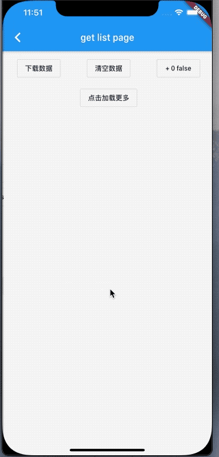
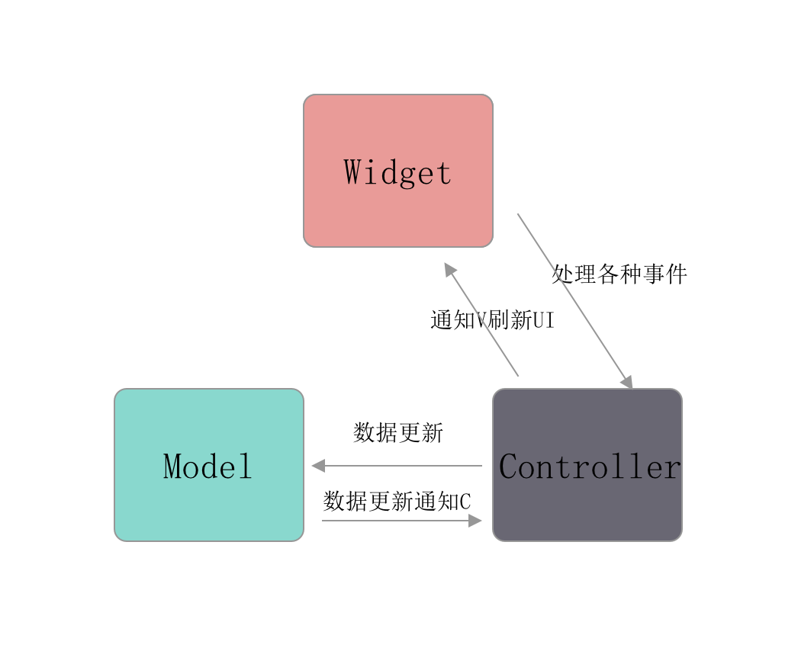

## GetX
包含了常用的屏幕高度和宽度还有局部刷新等

## 效果



## 代码

其实就是标准的`MVC`

`V`在flutter中叫做`StatefullWidget、StatelessWidget`,`M`是`Model`,`C`是`Controller`.
有数据更新在`C`中实现，自动更新`V`,实现原理是利用了`Stream`的流，每次有新的数据，则会刷新`V`.


通过`obs`来更新局部`UI`
```
final log = ''.obs;
```
在`Widget`中：

```
ObxValue((v) {
            return Text('${v.value}');
          }, c.log),
```

完整的代码看仓库即可。


## 小技巧
#### 1.在Get中，页面和`Controller`是有绑定关系的，当然多个页面也可以绑定同一个`Controller`，在进行初始化的时候也可以进行绑定。
```
GetMaterialApp(
      getPages: [
        GetPage(name: GetLoginPage.routeName, page: () => GetLoginPage(), binding: GetLoginBind())
      ],
    );
    
    
  class GetLoginBind extends Bindings {
  @override
  void dependencies() {
        Get.lazyPut(() => GetLoginController());
      }
    }
    
```
这里是将`GetLoginBind`中的`GetLoginController`进行绑定，当使用`Get.toName()`则执行`binding`的对象的方法。如果依赖多个`C`则使用`bindings`参数。使用的局限是需要使用`Get.toName()`才会执行绑定关系的实例，否则不执行。

#### 2. 普通StatefullWidget

需要在`State<Page>`中执行`Get.put(Controller())`,然后再调用。

```

class GetListPageRoute extends StatefulWidget {
  static final String routeName = "getListPage";

  @override
  State<StatefulWidget> createState() {
    return GetListPageRouteState();
  }
}

class GetListPageRouteState extends State<GetListPageRoute> {
/// 在初始化进行添加
  final GetListController c = Get.put(GetListController());

  @override
  Widget build(BuildContext context) {
    printInfo(info: 'build');
    return Scaffold(
      appBar: AppBar(
        title: Text('get list page '),
      ),
      body: _body()
      )
    }
  @override
  void dispose() {
    /// 从当前和页面删除 数据
    /// 下次进来 需要重新请求数据
    Get.delete<GetListController>();
    super.dispose();
  }
}
```

##### 3. 当退出页面的时候需要删除数据
只需要在当前页面的`dispose`删除即可
```
Get.delete<Controller>();
```
##### 3. Obx与ObxValue如何实现刷新?
`Obx`内部是继承了`StatefulWidget`，内部定义了一个`Rx()`,当`Rx()`接受到消息则刷新`UI`。


```
class Obx extends StatefulWidget {
  final WidgetCallback builder;

  const Obx(this.builder);

  _ObxState createState() => _ObxState();
}

class _ObxState extends State<Obx> {
  RxInterface _observer;
  StreamSubscription subs;

  _ObxState() {
    _observer = Rx();
  }

  @override
  void initState() {
  /// 当接收到新的值则进行刷新当前元素
    subs = _observer.subject.stream.listen((data) => setState(() {}));
    super.initState();
  }

  @override
  void dispose() {
  /// 取消监听 和关闭流
    subs.cancel();
    _observer.close();
    super.dispose();
  }

  Widget get notifyChilds {
    final observer = getObs;
    getObs = _observer;
    /// builder()执行，刷新UI
    final result = widget.builder();
    if (!_observer.canUpdate) {
      throw ''
    }
    getObs = observer;
    return result;
  }
  @override
  Widget build(BuildContext context) => notifyChilds;
}
```

那么消息是从哪里发送过来的呢？为什么`OBx()`内部的`obs`和`controlelr`内部的`"abc".obs`建立关联呢？请看下文


## 响应式原理

简单的使用已经介绍完毕，那么它是如何实现响应式的呢？

### Rx()

首先在使用`Obx()`之前，我们会定义一个`obs`

```
final count = "日志".obs
```
那么这个`count`的类型是`RxString`

```
extension StringExtension on String {
  /// Returns a `RxString` with [this] `String` as initial value.
  RxString get obs => RxString(this);
}
```
我们看下`RxInt`的内部代码：

```
class RxInt extends _BaseRxNum<int> {
...
}
```
`RxInt()`继承了`_BaseRxNum`,在看下`_BaseRxNum`内部：

```
abstract class _BaseRxNum<T extends num> extends _RxImpl<T> {
  _BaseRxNum(T initial) : super(initial);
  }
```

最终找到了一个叫`_RxImpl`类，这里边实现了通知的各种操作问题。

首先看下代码：

```
abstract class _RxImpl<T> implements RxInterface<T> {
  _RxImpl(T initial) {
    _value = initial;
  }
  StreamController<T> subject = StreamController<T>.broadcast();
  final _subscriptions = HashMap<Stream<T>, StreamSubscription>();

  T _value;

  bool get canUpdate => _subscriptions.isNotEmpty;

 
  T call([T v]) {
    if (v != null) {
      value = v;
    }
    return value;
  }

  void refresh() {
    subject.add(value);
  }


  void update(void fn(T val)) {
    fn(_value);
    subject.add(_value);
  }

  
  void nil() {
    subject.add(_value = null);
  }

  /// Same as `toString()` but using a getter.
  String get string => value.toString();

  @override
  String toString() => value.toString();

  /// Returns the json representation of `value`.
  dynamic toJson() => value;

  /// This equality override works for _RxImpl instances and the internal
  /// values.
  @override
  // ignore: avoid_equals_and_hash_code_on_mutable_classes
  bool operator ==(dynamic o) {
    // Todo, find a common implementation for the hashCode of different Types.
    if (o is T) return value == o;
    if (o is RxInterface<T>) return value == o.value;
    return false;
  }

  @override
  // ignore: avoid_equals_and_hash_code_on_mutable_classes
  int get hashCode => _value.hashCode;

  /// Closes the subscriptions for this Rx, releasing the resources.
  void close() {
    _subscriptions.forEach((observable, subscription) => subscription.cancel());
    _subscriptions.clear();
    subject.close();
  }

  /// This is an internal method.
  /// Subscribe to changes on the inner stream.
  void addListener(Stream<T> rxGetx) {
    if (_subscriptions.containsKey(rxGetx)) {
      return;
    }
    _subscriptions[rxGetx] = rxGetx.listen((data) {
      subject.add(data);
    });
  }

  bool firstRebuild = true;

  set value(T val) {
    if (_value == val && !firstRebuild) return;
    firstRebuild = false;
    _value = val;
    subject.add(_value);
  }

  /// Returns the current [value]
  T get value {
    if (getObs != null) {
      getObs.addListener(subject.stream);
    }
    return _value;
  }

  Stream<T> get stream => subject.stream;

  StreamSubscription<T> listen(void Function(T) onData,
          {Function onError, void Function() onDone, bool cancelOnError}) =>
      stream.listen(onData, onError: onError, onDone: onDone);

  void bindStream(Stream<T> stream) {
    _subscriptions[stream] = stream.listen((va) => value = va);
  }

  Stream<R> map<R>(R mapper(T data)) => stream.map(mapper);
}

```


我们摘出来主要的函数`get value`/`set value`/`addListener`

```
void addListener(Stream<T> rxGetx) {
    if (_subscriptions.containsKey(rxGetx)) {
      return;
    }
    _subscriptions[rxGetx] = rxGetx.listen((data) {
      subject.add(data);
    });
  }

  bool firstRebuild = true;

  set value(T val) {
    if (_value == val && !firstRebuild) return;
    firstRebuild = false;
    _value = val;
    subject.add(_value);
  }

  T get value {
    if (getObs != null) {
      getObs.addListener(subject.stream);
    }
    return _value;
  }
```

继承`_RxImpl`的子类，在获取`value`的时候把自己的流的监听给了`getObs`,现在的全局变量`getObs`是`Obx()`的，千言万语不如一张图：


> 当Obx()build的时候全局变量的值是Obx()的obs，然后在widget.builder()执行controller.value读取value进行添加，添加函数中对controller.obs进行了监听，做到了响应式。每个Obx()都有自己的Obx()，做到了局部刷新。